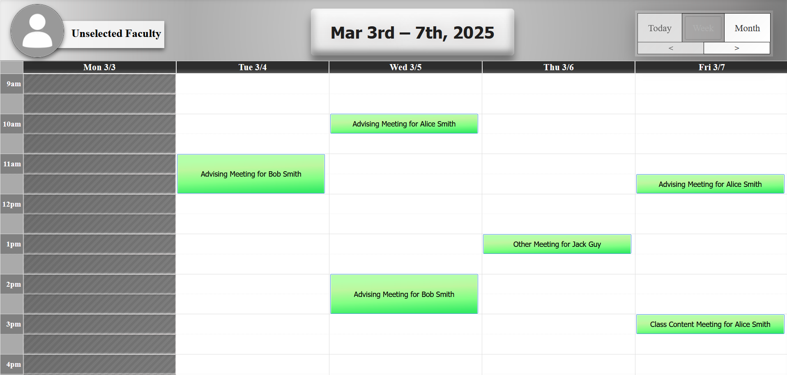
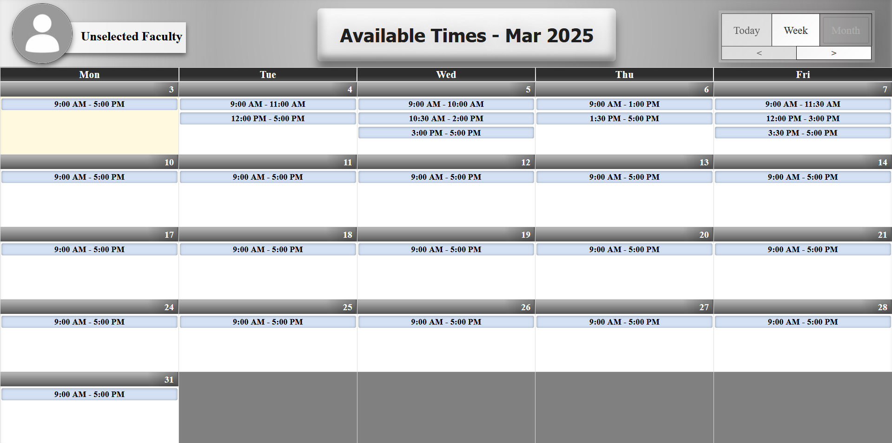

# Calendar Scheduler

  
  

## Description
Calendar Scheduler is a project designed to facilitate seamless appointment scheduling, with integration capabilities for Microsoft Calendar. This tool aims to streamline the process of booking and managing appointments, making it easier for users to keep track of their schedules.

## Features
- **Appointment Scheduling**: Easily schedule and manage appointments.
- **Microsoft Calendar Integration**: Sync your appointments with Microsoft Calendar.
- **User-Friendly Interface**: Intuitive and easy-to-use interface.
- **Responsive Design**: Works on both desktop and mobile devices.

## Features in Development
- Backend development  
- Integration with Microsoft Calendar  
- Minor feature improvements  
- Settings Page  
- User/Faculty Authentication  
- Mobile Design  

## How to Use
1. **Download Files**: Clone or download the repository to your local machine.
2. **Run Files through a Live Server**:
   - This can be done through the live server extension in VS Code for testing.
   - Required because of cross-script security in modern browsers.
3. **Open in Browser**: Open the project in your preferred web browser to start using the Calendar Scheduler.

## Installation
1. Clone the repository:
   ```sh
   git clone https://github.com/your-username/calendar-scheduler.git
